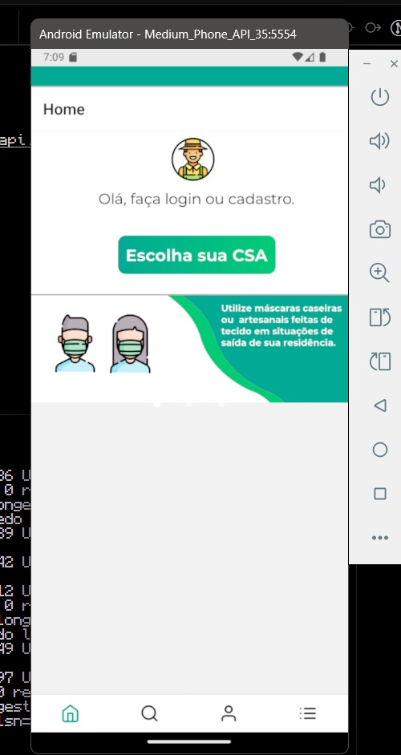
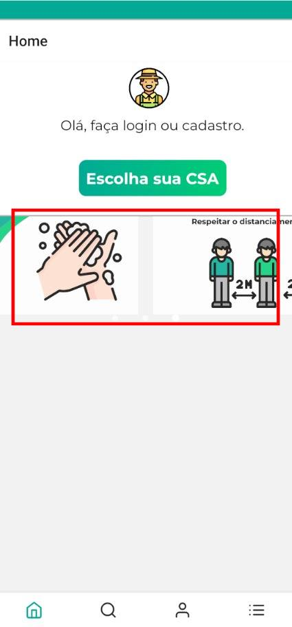
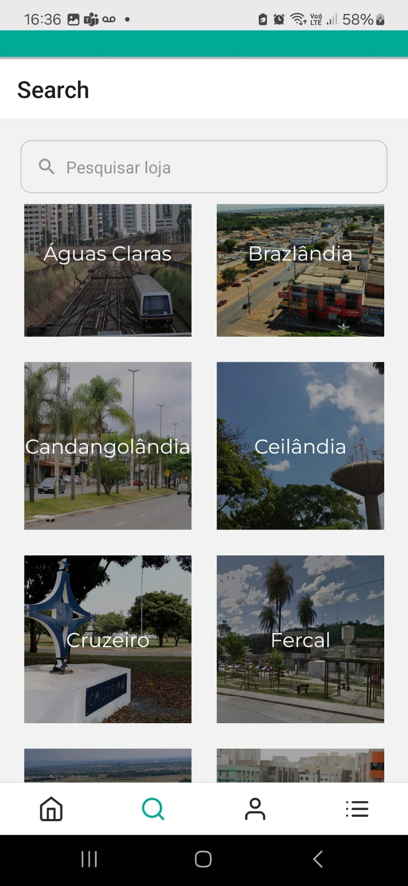
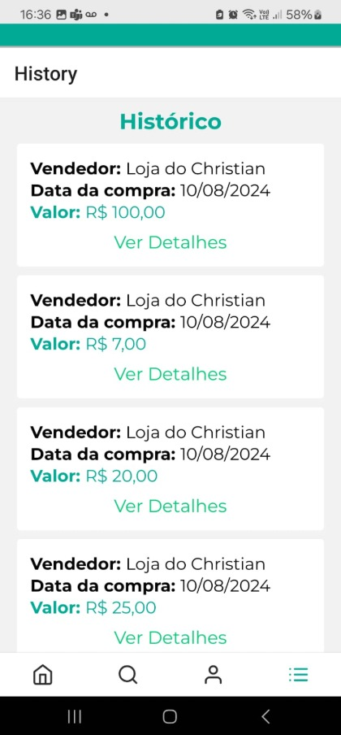

# Avaliação

## Avaliação de Adequação Funcional - Observações

### Cobertura de Implementação Funcional (M1)

- **(F1) Cadastro**: não foi possível verificar, pois não há ambiente de testes funcional disponível.  
- **(F2) Login**: não foi possível verificar o fluxo completo, considerando apenas as capturas de tela.  
- **(F3) Instalação**:
  - Não há aplicativo publicado em lojas oficiais (Google Play, App Store).  
  - Não existe um APK pronto para download direto.  
  - O tutorial de parte do deploy encontra-se armazenado em um repositório separado das aplicações ([Ajuda AgroMart](https://github.com/AgroMart/ajuda-agromart)).  
- **(F4) Uso**: não pôde ser avaliado de forma completa devido à ausência de ambiente interativo funcional.  
- **(F5) Compra**: não foi possível verificar as operações de compra em funcionamento, considerando que apenas as telas estáticas foram fornecidas.  

## Avaliação de Usabilidade - Observações

### Clareza das Mensagens (M4)

- As descrições dos menus apresentam uma fonte com cor muito clara, dificultando a leitura em alguns dispositivos.

**Figura 1**: Tela de Inicial

- Na tela inicial há um carrossel de imagens, porém os indicadores visuais que evidenciam tratar-se de um carrossel são difíceis de perceber, pois as três bolinhas estão quase imperceptíveis devido à sua cor. O usuário precisa arrastar manualmente para descobrir outras imagens, o que pode gerar confusão.

**Figura 2**: Tela inicial do aplicativo mostrando o carrossel 

- A tela de busca de CSA está bem estruturada, apresentando imagens de pontos específicos de cada região administrativa, acompanhadas do respectivo nome, o que facilita a compreensão.

**Figura 3**: Tela de csa 

### Nomenclatura em Inglês

- Alguns termos do aplicativo estão apresentados em inglês (por exemplo, *History*), o que pode dificultar o entendimento do público-alvo, formado majoritariamente por usuários sem familiaridade com outros idiomas.

- O ícone da tela de histórico é representado por três linhas (menu tipo hambúrguer), o que pode gerar dúvidas, pois não está claramente identificado como “Histórico”.

## Consistência Operacional (M5)

- O aplicativo apresenta boa responsividade e funcionamento consistente no ambiente mobile, o que é positivo.

## Completude e Facilidade de Uso da Documentação (M6)

- De forma geral, o usuário consegue acessar e navegar pelas telas, compreendendo os textos e imagens apresentados.  
- Contudo, a utilização de termos estrangeiros pode ser um obstáculo para alguns usuários, prejudicando a completude e a facilidade de uso.

## Tempo de Aprendizado

- O tempo de aprendizado depende do perfil do usuário.  
- O uso de cores muito semelhantes em determinadas telas pode gerar confusão visual, principalmente para usuários com limitações cognitivas ou baixa visão.

## Prevenção para Operações Incorretas (M7)

- Ainda não foram identificados mecanismos claros de prevenção a operações incorretas, tampouco feedbacks de erro visíveis no sistema. Recomenda-se mapear esses pontos futuramente para aumentar a segurança operacional e evitar falhas de uso.

## Histórico de Versão

<table border="1" style="width:100%; border-collapse: collapse; text-align: left;">
  <thead>
    <tr>
      <th>Versão</th>
      <th>Data</th>
      <th>Descrição</th>
      <th>Autor(a)</th>
    </tr>
  </thead>
  <tbody>
    <tr>
      <td>1.0</td>
      <td>31/05/2025</td>
      <td>Commit inicial, incluindo Objetivos, ODS e questões de análise</td>
      <td>Raphael Mendes da Silva, Leonardo Barcellos, Breno Lucena, Luis Zarbielli</td>
    </tr>
    <tr>
      <td>1.1</td>
      <td>02/07/2025</td>
      <td>Revisão</td>
      <td>Leonardo Barcellos, Breno Lucena, Luis Zarbielli</td>
    </tr>
  </tbody>
</table>

