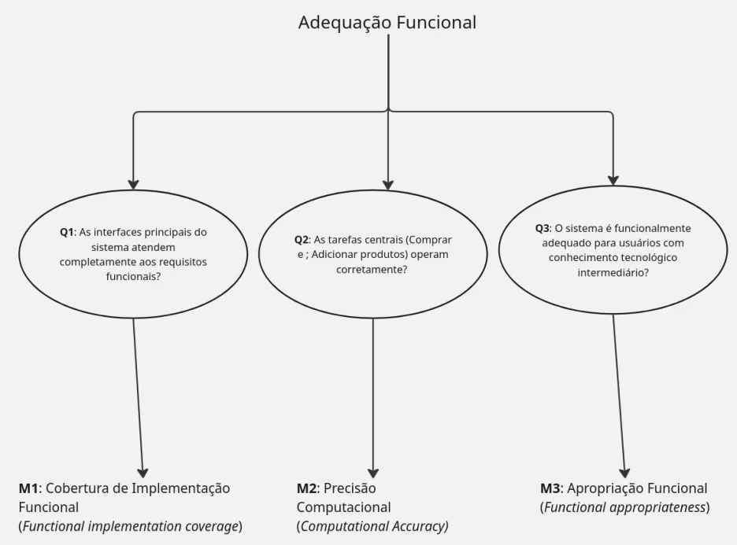
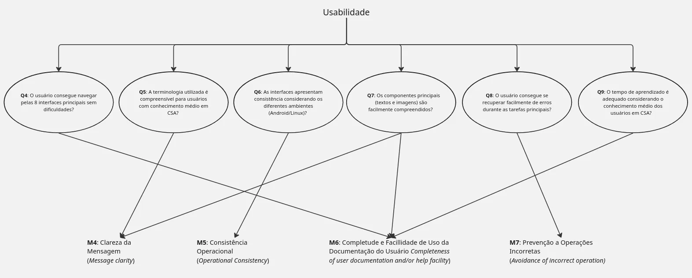

# Goal-Question-Metric (GQM)

## Propósito Empresarial do AgroMart

A finalidade comercial do AGROMART consiste em criar uma solução tecnológica revolucionária que promova a ligação direta entre produtores agrícolas e compradores finais, particularmente considerando as dificuldades geradas pelo distanciamento social durante a crise sanitária da COVID-19. A plataforma concentra seus esforços em simplificar e potencializar a venda de produtos sustentáveis, garantindo acesso imediato ao mercado para pequenos agricultores, apoiando a criação e gestão de Comunidades que Sustentam a Agricultura (CSAs).

## Objetivos de Medição

### Objetivo 1: Adequação Funcional
|||
|---|---|
| Analisar | AgroMart |
| Para o propósito de | Entender |
| Com Respeito a | Adequação Funcional |
| Ponto de Vista | Dono do Produto e Agricultor CSA |
| Contexto | Sistema com 8 interfaces principais e usuários com conhecimento tecnológico intermediário |

### Objetivo 2: Usabilidade e Aprendizado
|||
|---|---|
| Analisar | AgroMart |
| Para o propósito de | Entender |
| Com Respeito a | Usabilidade |
| Ponto de Vista | Consumidores CSA e Agricultores CSA |
| No contexto de | Sistema com componentes textuais/visuais e usuários com conhecimento médio em CSA |

## Questões e Métricas - Objetivo 1: Adequação Funcional

> **Q1:** As interfaces principais do sistema atendem completamente aos requisitos funcionais?  
> **Hipótese 1:** Pelo menos 85% das funcionalidades nas interfaces principais foram implementadas adequadamente.  

> **Q2:** As tarefas centrais (Comprar e Adicionar produtos) operam corretamente?  
> **Hipótese 2:** 90% das operações de compra e adição de produtos executam sem erros.  

> **Q3:** O sistema é funcionalmente adequado para usuários com conhecimento tecnológico intermediário?  
> **Hipótese 3:** 80% dos usuários conseguem executar funcionalidades sem suporte técnico.  

## Questões e Métricas - Objetivo 2: Usabilidade

> **Q4:** O usuário consegue navegar pelas 8 interfaces principais sem dificuldades?  
> **Hipótese 4:** 90% dos usuários navegam entre as interfaces sem abandonar tarefas.  

> **Q5:** A terminologia utilizada é compreensível para usuários com conhecimento médio em CSA?  
> **Hipótese 5:** 85% dos usuários entendem os termos relacionados à agricultura sustentável sem explicação adicional.  

> **Q6:** As interfaces apresentam consistência considerando os diferentes ambientes (Android/Linux)?  
> **Hipótese 6:** 90% dos usuários percebem consistência visual e processual entre diferentes dispositivos.  

> **Q7:** Os componentes principais (textos e imagens) são facilmente compreendidos?  
> **Hipótese 7:** 85% dos elementos visuais são interpretados corretamente sem legendas auxiliares.  

> **Q8:** O usuário consegue se recuperar facilmente de erros durante as tarefas principais?        
> **Hipótese 8:** 80% dos usuários conseguem corrigir erros sem abandonar a tarefa.  

> **Q9:** O tempo de aprendizado é adequado considerando o conhecimento médio dos usuários em CSA?            
> **Hipótese 9:** Tempo médio de aprendizado das funcionalidades ≤ 15 minutos.

## Métricas
Adquiridas através da análise das perguntas e hipóteses e da consulta as ISOs de família SQUARE.

|ID|Nome|Objetivo|Cálculo|
|-|-|-|-|
|M1|Cobertura de Implementação Funcional (Functional implementation coverage)| Como completar a implementação de acordo com as especificações de requisito?|(Nº de funcionalidades nos requisitos) ÷ (Nº funcionalidades incorretas ou faltando)|
|M2|Precisão Computacional (Computational Accuracy)| O quão frequentes são resultados errados das funções implementadas?| (Nº de operações erradas) ÷ (tempo gasto nelas)|
|M3|Apropriação Funcional (Functional appropriateness)| Quantas funcionalidades realizam seus objetivos sem problemas?| (Nº de funções que realizam tarefas específicas) ÷ (Nº de funções com problemas)|
|M4|Clareza da Mensagem (Message clarity)|O quão clara mensagens operacionais do sistema podem ser entendidas?| (Nº de mensagens claras) ÷ (Total de mensagens) |
|M5|Consistência Operacional (Operational Consistency)|O quão consistentes são operações similares| (Nº de operações inconsistentes) ÷ (Nº de operações de comportamento similar) |
|M6|Completude e Facillidade de Uso da Documentação do Usuário (Completeness of user documentation and/or help facility)|Qual a proporção da funcionalidades descritas na documentação?|(Nº de funcionalidades descritas corretamente) ÷ (Nº total de funcionalidades) |
|M7|Prevenção a Operações Incorretas (Avoidance of incorrect operation - AIO)|Quantas funcionalidades têm prevenção a operações incorretas?| (Nº de funcionalidades que implementaram AIO) ÷ (Nº total de padrões de operações incorretas) |

## Relação entre Objetivos de Medição - Questões e Métricas - Objetivo de Medição 1: Adequação Funcional

Figura 2 - Questões e Métricas - Adequação Funcional

## Relação entre Objetivos de Medição - Questões e Métricas - Objetivo de Medição 2: Usabilidade

Figura 3 - Questões e Métricas - Confiabilidade

## Fontes e Heurísticas para as Questões

| Questão | Fonte / Heurística ou Norma |
|:---|:---|
| **Q1-Q3** | **ISO/IEC 25010:2011 – Functional Suitability**. Completude, correção e adequação funcional. |
| **Q4** | **Heurística 6 – Reconhecimento em vez de memorização** (Nielsen, 1995). Facilitar navegação e reduzir carga cognitiva. |
| **Q5** | **Heurística 2 – Correspondência entre o sistema e o mundo real** (Nielsen, 1995). Usar linguagem familiar ao domínio CSA. |
| **Q6** | **Heurística 4 – Consistência e padrões** (Nielsen, 1995). Manter padrões entre diferentes ambientes. |
| **Q7** | **Affordances e Signifiers** (Norman, 1988). Elementos visuais devem comunicar sua função naturalmente. |
| **Q8** | **Heurística 5 – Prevenção de erros** e **Heurística 9 – Recuperação de erros** (Nielsen, 1995). |
| **Q9** | **ISO 9241-110:2020 – Suitability for learning**. Facilidade de aprendizado para usuários do domínio. |

## Referências Bibliográficas
> NIELSEN, Jakob. Usability Engineering. Academic Press, 1995.  
> NORMAN, Donald A. The Design of Everyday Things. Basic Books, 1988.  
> ISO/IEC 25010:2011 - Systems and software engineering - Systems and software Quality Requirements and Evaluation (SQuaRE)  
> ISO 9241-110:2020 - Ergonomics of human-system interaction

## Histórico de Versões
<table border="1" style="width:100%; border-collapse: collapse; text-align: left;">
  <thead>
    <tr>
      <th>Versão</th>
      <th>Data</th>
      <th>Descrição</th>
      <th>Autor(a)</th>
    </tr>
  </thead>
  <tbody>
    <tr>
      <td>1.0</td>
      <td>21/05/2025</td>
      <td>Criação do documento</td>
      <td>Leonardo Barcellos</td>
    </tr>
    <tr>
      <td>1.1</td>
      <td>22/05/2025</td>
      <td>Revisão</td>
      <td>Raphael Mendes</td>
    </tr>
    <tr>
      <td>1.2</td>
      <td>02/06/2025</td>
      <td>Expansão das questões</td>
      <td>Breno Lucena, Luis Zarbielli e Dannyeclisson Rodrigo</td>
    </tr>
    <tr>
      <td>1.3</td>
      <td>03/06/2025</td>
      <td>Revisão</td>
      <td>Leonardo Barcellos, Raphael Mendes da Silva e Breno Lucena</td>
    </tr>
  </tbody>
</table>

