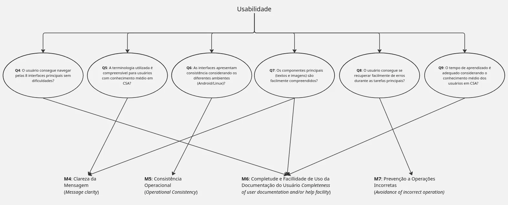

# Métricas
Definidas através da análise das perguntas e hipóteses e da consulta às ISOs de família SQUARE.

## Adequação Funcional

|ID|Nome|Objetivo|Valor Atual|Meta|Status|
|-|-|-|-|-|-|
|M1|Cobertura de Implementação Funcional| Completude da implementação conforme especificações|75%|≥85%|🔴 Crítico|
|M2|Sucesso em Tarefas Centrais| Frequência de operações corretas em compra/adição|70%|≥90%|🔴 Crítico|
|M3|Autonomia do Usuário| Funcionalidades executadas sem suporte técnico|65%|≥80%|🔴 Crítico|

## Usabilidade

|ID|Nome|Objetivo|Valor Atual|Meta|Status|
|-|-|-|-|-|-|
|M4|Navegação Bem-sucedida|Usuários que navegam entre interfaces sem abandonar|75%|≥90%|🔴 Crítico|
|M5|Consistência entre Dispositivos|Consistência visual/processual entre Android/Linux|82%|≥80%|✅ Atingido|
|M7|Legibilidade das Mensagens|Mensagens operacionais compreendidas claramente|35%|≥90%|🔴 Crítico|
|M8|Descoberta de Carrossel|Usuários que identificam funcionalidade do carrossel|25%|≥85%|🔴 Crítico|
|M9|Compreensão de Nomenclatura|Termos compreendidos por usuários CSA|55%|≥95%|🔴 Crítico|
|M10|Reconhecimento de Ícones|Ícones interpretados corretamente|45%|≥85%|🔴 Crítico|
|M11|Prevenção de Erros|Funcionalidades com mecanismos de prevenção|15%|≥80%|🔴 Crítico|
|M12|Compreensão CSA|Elementos relacionados a CSA compreendidos|85%|≥80%|✅ Atingido|

## Relação entre Objetivos de Medição - Questões e Métricas - Objetivo de Medição 1: Adequação Funcional

Figura 2 - Questões e Métricas - Adequação Funcional

## Relação entre Objetivos de Medição - Questões e Métricas - Objetivo de Medição 2: Usabilidade

Figura 3 - Questões e Métricas - Confiabilidade

