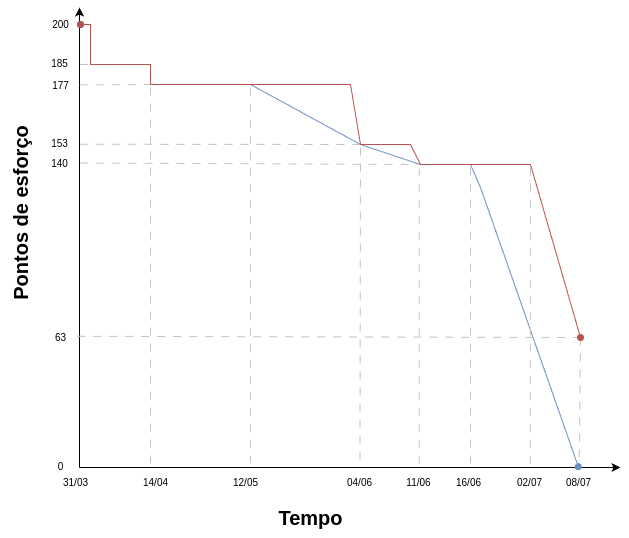

# PSM/CID: Processo de Software Medido / Ciclo de Integração de Dados

Para a gestão do projeto, utilizou-se métricas PSM-CID para acompanhar o andamento do trabalho e monitorar o progresso da equipe.


## O que é o PSM/CID?

O **PSM/CID (Processo de Software Medido / Ciclo de Integração de Dados)** é um framework de gerenciamento que visa integrar o desenvolvimento de software com métricas quantitativas e ciclos contínuos de integração e avaliação de dados. Essa abordagem promove decisões baseadas em evidências, aumentando a previsibilidade e a eficiência no desenvolvimento de sistemas complexos.

## Por que usar PSM/CID no AgroMart?

- **Medição Contínua:** Permite acompanhar, em tempo real, indicadores críticos de desempenho e qualidade do software.
- **Integração de Dados:** Garante consistência e atualização contínua das informações, promovendo decisões estratégicas mais embasadas.
- **Aprimoramento Iterativo:** Facilita a adaptação e melhoria contínua da gestão de projeto com base em dados coletados durante todo as iterações.
<!--
- **Aderência** às necessidades do negócio: Conecta metas técnicas a metas organizacionais, especialmente em um contexto sensível como o agronegócio.
-->

## Calendário e Progesso
### Gráfico de Burndown



## Desempenho de processos
<script src="https://cdn.jsdelivr.net/npm/chart.js"></script>
<script src="../../scripts/psm-desempenho.js"></script>

### Cumulative Flow Diagram

<canvas id="cumulativeFlowChart" width="800" height="400"></canvas>

### Cycle Time

<canvas id="cycleTimeChart" width="800" height="400"></canvas>

### Team Velocity

<canvas id="teamVelocityChart" width="800" height="400"></canvas>

## Recursos e Custo
### Custo total da operação

Duração do projeto (D): 4 meses.

Custo de pessoas (P)

| Membro | Custo por mês  | 
|-------------|-----------|
| Raphael Mendes da Silva | R$8.500,00 |
| Leonardo Barcellos      | R$2.500,00 |
| Breno Lucena            | R$5.000,00 |     
| Luis Zarbielli          | R$3.000,00 |     
| Dannyeclisson           | R$1.860,00 | 


Custo de recursos (R)

| Membro | Porcentagem | 
|-----|-----------|
| Heroku | R$6,00 |
| Visual Code | Gratuito |     
| ExpoGo | Gratuito |
| Github | Gratuito |
| Github Pages | Gratuito |
| Git | Gratuito |
| Copilot (Pro) | Gratuito (conta estudantil) |

```
Total = E + D * P
Total = (R$6,00) + (4) * (R$8.500,00 + R$2.500,00 + R$5.000,00 + R$3.000,00 + R$1.860,00)
Total = R$ 83.440,00
```

## Histórico de Versão

<table border="1" style="width:100%; border-collapse: collapse; text-align: left;">
  <thead>
    <tr>
      <th>Versão</th>
      <th>Data</th>
      <th>Descrição</th>
      <th>Autor(a)</th>
    </tr>
  </thead>
  <tbody>
    <tr>
      <td>1.0</td>
      <td>06/07/2025</td>
      <td>Commit inicial, incluindo Objetivos, ODS e questões de análise</td>
      <td>Raphael Mendes da Silva</td>
    </tr>
    <tr>
      <td>1.1</td>
      <td>07/07/2025</td>
      <td>Descrição do PSM-CID e motivos para usa-lo</td>
      <td>Leonardo Barcellos e Raphael Mendes da Silva</td>
    </tr>
    <tr>
      <td>1.2</td>
      <td>07/07/2025</td>
      <td>Gráficos de desempenho</td>
      <td>Leonardo Barcellos, Raphael Mendes da Silva e Breno Lucena</td>
    </tr>
    <tr>
      <td>1.3</td>
      <td>07/07/2025</td>
      <td>Custo</td>
      <td>Leonardo Barcellos, Raphael Mendes da Silva, Breno Lucena, Dannyeclisson e Luis Zarbielli</td>
    </tr>
  </tbody>
</table>